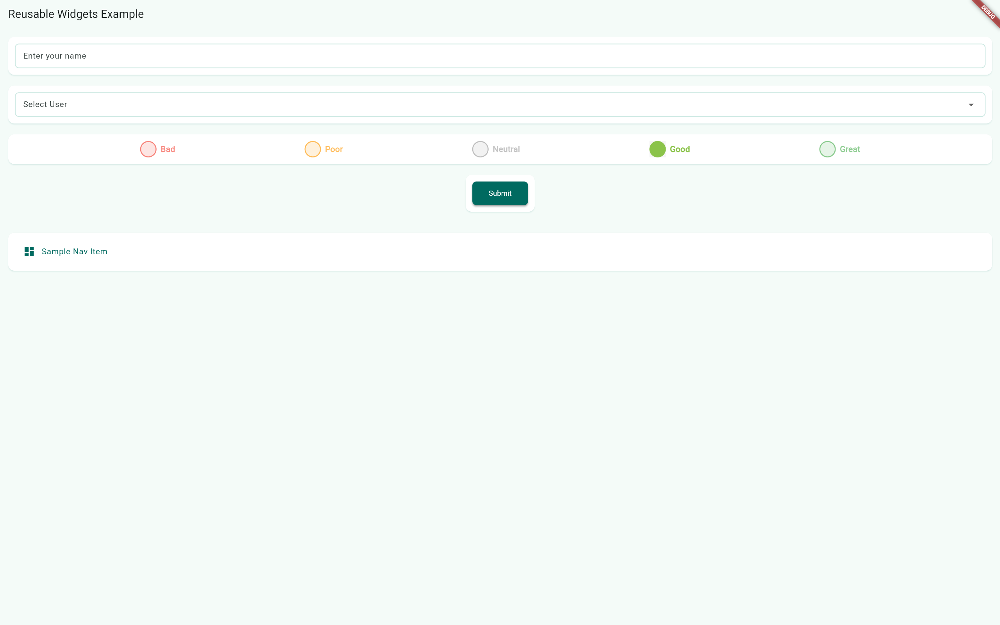

# 🧱 Reusable Flutter Widgets

A collection of reusable Flutter widgets for faster and cleaner UI development. Designed for flexibility, consistency, and easy integration across multiple projects.

---

## 📦 Features

- Customizable and consistent widget styling
- Easy to integrate into any Flutter project
- Clean code with clear documentation
- Ready for future pub.dev publishing

---

## 🚀 Getting Started

### Clone and use locally

In your `pubspec.yaml`, reference the package like this:

```yaml
dependencies:
  reusable_widgets:
    path: ../reusable_widgets # Update with the actual path
```

Then import it in your Dart file:

```dart
import 'package:reusable_widgets/reusable_widgets.dart';
```

---

## 💡 Example Usage

Here’s a basic example using one of the widgets:

```dart
import 'package:flutter/material.dart';
import 'package:reusable_widgets/reusable_widgets.dart';

void main() => runApp(const MyApp());

class MyApp extends StatelessWidget {
  const MyApp({super.key});

  @override
  Widget build(BuildContext context) {
    return MaterialApp(
      home: Scaffold(
        appBar: AppBar(title: const Text("Demo")),
        body: Center(
          child: MyCustomButton(
            label: "Click Me",
            onPressed: () => print("Button pressed!"),
          ),
        ),
      ),
    );
  }
}
```

---

## 🗂️ Folder Structure

```
lib/
├── widgets/
│   ├── my_custom_button.dart
│   └── ...
├── reusable_widgets.dart

example/
└── lib/
    └── main.dart
```

---

## 🤝 Contributing

Pull requests are welcome. For major changes, please open an issue first to discuss what you would like to change.

---

## 📄 License

This project is licensed under the [MIT License](LICENSE).

---

## 📷 Screenshots


